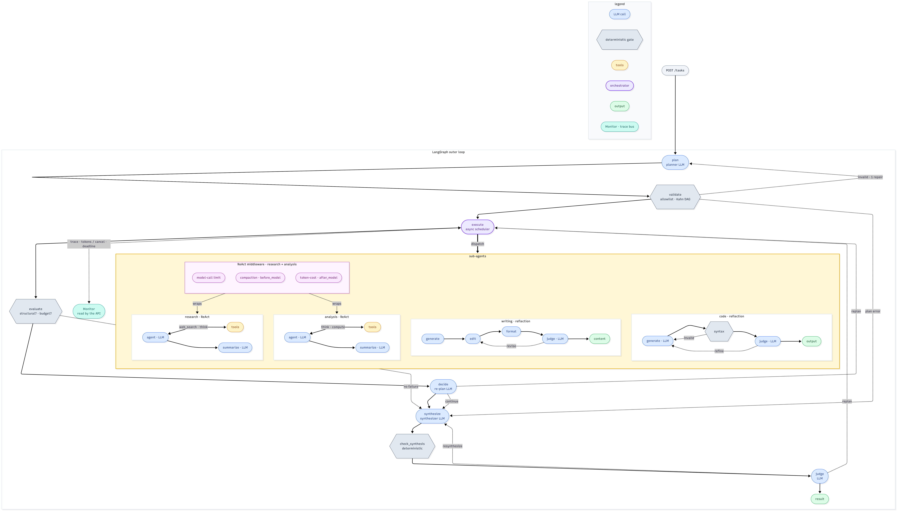

# Architecture

The LangGraph outer loop — a linear `plan → execute → evaluate → synthesize → judge` spine with
bounded back-loops — and the four sub-agents it runs inside `execute`. **Shape encodes nature:**
rounded = LLM call, hexagon = deterministic gate/check.

**Legend** — blue = LLM call · slate hexagon = deterministic gate/check · purple = orchestrating node
(runs the scheduler) · amber = tools · green = output · teal = Monitor (observability + control bus).
Yellow box = the sub-agent layer; the magenta box is its ReAct middleware (labelled inline).

## Outer loop (`engine/graph.py`, `engine/nodes.py`)

- **plan** (LLM) → **validate** (deterministic): unique ids, agent/action allowlist, resolvable deps, Kahn acyclicity. One bounded planner repair on invalid; an unrepairable plan error short-circuits to **synthesize**.
- **execute** — the continuous-concurrency scheduler (`engine/scheduler.py`); `dispatch` routes each step to its agent with upstream context. `classify_failure` (deterministic) tags a failure structural vs skippable; a structural one preempts in-flight steps.
- **evaluate** — deterministic gate (structural failure? within `max_replans`?) → **decide** (re-plan LLM) → `merge_replan`. Loops to **execute** on `replan`, else **synthesize**.
- **synthesize** (LLM) — combines outputs with provenance; `fallback_synthesis` (deterministic) assembles an answer if the call fails.
- **judge** — `check_synthesis` (deterministic) + judge (LLM) → `accept` (end), `resynthesize`, or `replan`; corrective loops share the bounded budgets.

## Sub-agents (the yellow box, run inside **execute**)

- **research / analysis** — `create_agent` ReAct loops (agent ⇄ tools) then one structured LLM summary. Research tools `web_search` / `think` (+ citations, bounded re-ask on a malformed tool call); analysis tools `think` / `compute`. Shared middleware (`general_utils/middleware.py`): a **model-call limit** (loop cap), **compaction** firing `before_model` once history passes a trigger (keeping the recent N, never on the first turn), and **token-cost capture** on `after_model` accrued into the runtime context so compaction can't erase the running totals.
- **code** — `generate` (LLM) → `syntax` parse (deterministic, retries) → `judge` (LLM review) → `refine`, producing a typed `CodeOutput`.
- **writing** — `generate → edit → format` (LLM) → `judge` (LLM) looping to `edit`/`format` until accept or the revision cap.

Each sub-agent returns one `AgentResult`, recorded into the [Monitor](OBSERVABILITY.md) the API reads.
